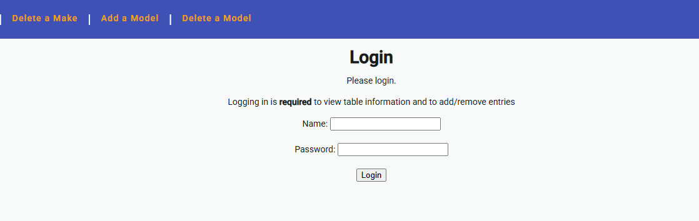
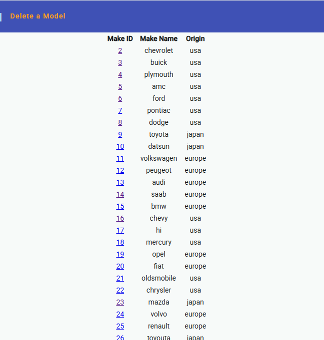
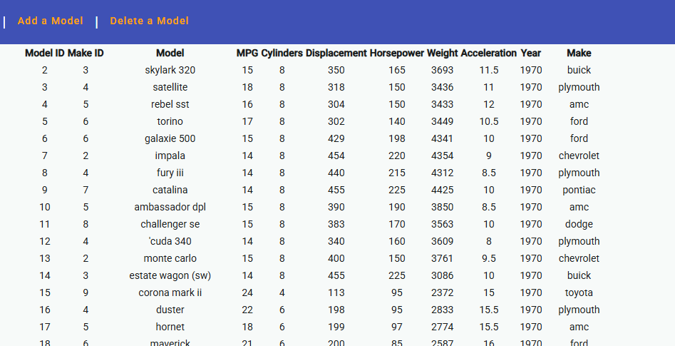
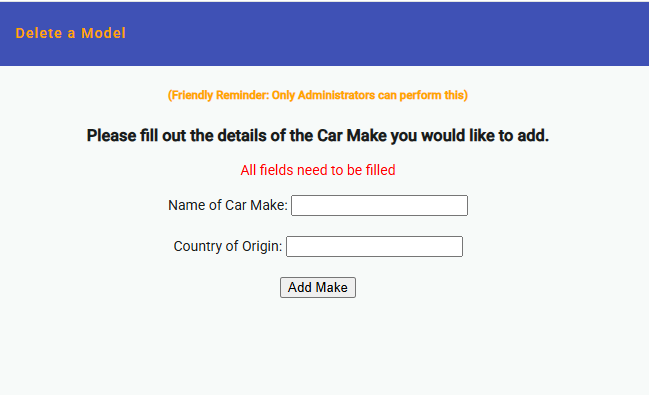
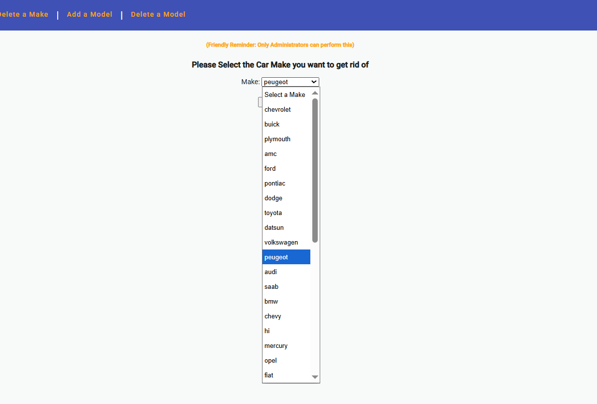
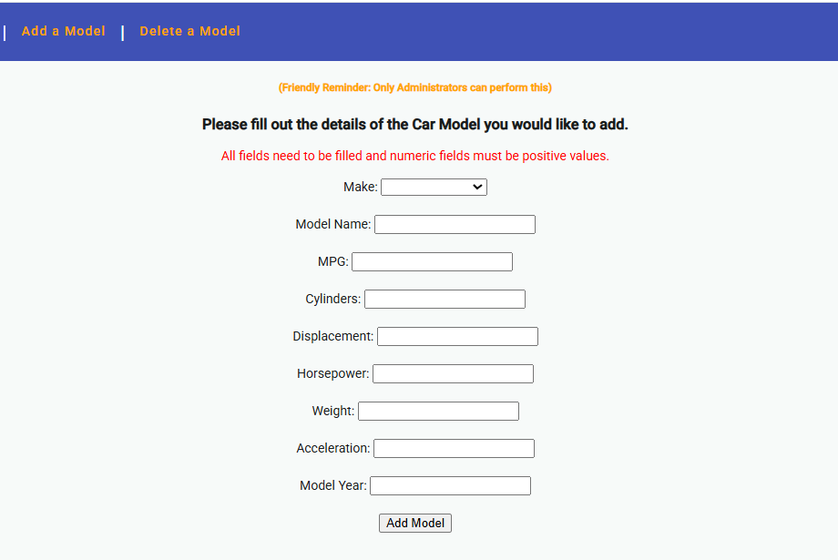
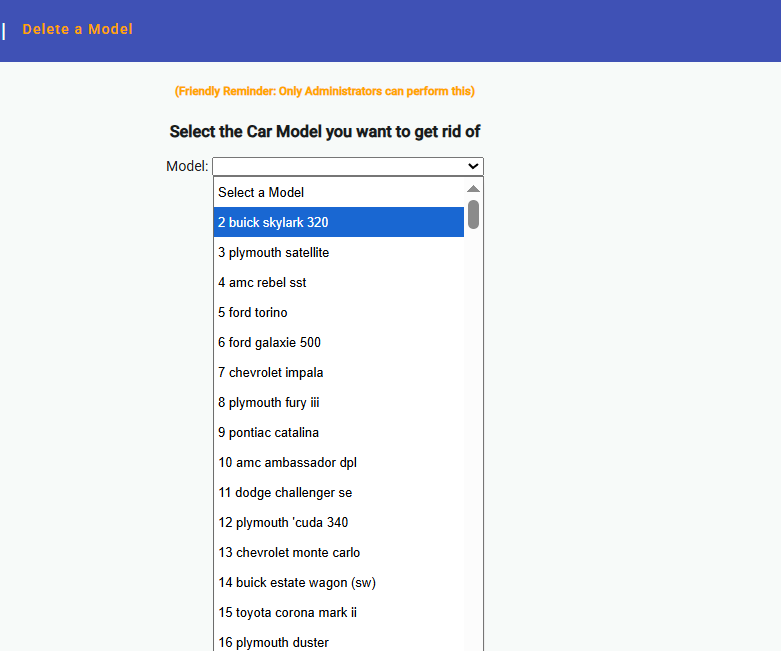
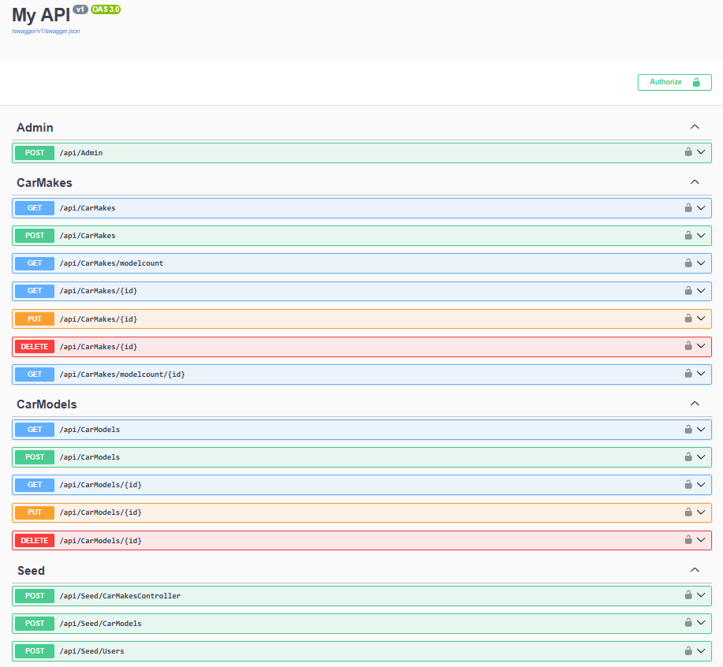

# Car Database SPA

This application is a **Single Page Application (SPA)** built with **Angular** on the **Client Side**.

The **backend** is powered by **ASP.NET Core/C#**.

Both client and server sides follow the **Model-View-Controller (MVC) architecture**.

The **database** used is **Microsoft SQL Server**, with **Entity Framework** for Object-Relational Mapping.

The database contains a **one-to-many relationship** between two tables:  

- **Car Makes (1)**  
- **Car Models (*)**

---

## Authentication & Authorization

- **Authentication**: Users can **log in** to access the tables.  
- **Authorization**: Certain actions are restricted to **Admin users only**.

**User Roles**:  

- **Regular Users**: Can **view car makes** and their associated models.  
- **Administrators**: Can **view, add, and delete entries** as needed.

**Forms**:  

- **Login, Add, and Delete functionalities** use **Reactive Forms** for complex data entry.

---

## Navigation Overview

- **Make List**: View all car makes currently in the database.  
  - See the **number of models** associated with each make.  
  - Click on a **make id** to view the number of models.  
  - *(Admin or Regular User login is required)*

- **Model List**: Check the **models associated** with each car make.  
  - Helps track which models belong to which make.  
  - *(Admin or Regular User login is required)*

- **Add a Make**: Add a **new car make** to the database.  
  - *(Admin login required)*

- **Delete a Make**: Remove a **car make** from the database.  
  - *(Admin login required)*

- **Add a Model**: Add a **new car model** to the database.  
  - *(Admin login required)*

- **Delete a Model**: Remove a **car model** from the database.  
  - *(Admin login required)*

---

## Side Notes

- **Admin login** is required for **adding or deleting car makes/models**.  
- **Registered User login** is required for **viewing any tables**.  
- **All form fields** have **validation rules** to prevent empty or invalid entries.  
- The system ensures that **models are associated correctly** with their makes.

---

## Project Screenshots

### Home Page

### Login Page

### Make List

### Model List

### Add Make

### Delete Make

### Add Model

### Delete Model

---

### Backend API

